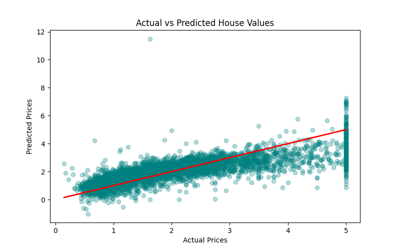

# House-Price-Prediction-Linear-Regression

Building and evaluating a Linear Regression model using the California Housing dataset.

## 📌 Project Overview
This project focuses on building and evaluating a Machine Learning model for predicting house prices using the California Housing dataset.

The project demonstrates the complete Machine Learning workflow including:
* Data Loading
* Exploratory Data Analysis (EDA)
* Data Preprocessing
* Feature Selection
* Model Training
* Prediction
* Model Evaluation
* Data Visualization

## 🛠️ Technologies Used
* Python
* pandas
* NumPy
* scikit-learn
* matplotlib
* seaborn

## 📁 Dataset
The California Housing dataset from scikit-learn was used in this project.
Features include:
* Median Income
* House Age
* Average Rooms
* Population
* Latitude
* Longitude

### Target:
* Median House Value

## 🤖 Machine Learning Algorithm
### Linear Regression
Linear Regression is a supervised Machine Learning algorithm used for predicting continuous numerical values.

## 📊 Model Evaluation Metrics
| Metric | Value |
| :--- | :--- |
| MAE | 0.533 |
| RMSE | 0.746 |
| R² Score | 0.576 |

## 📉 Visualizations
The project includes:
* Actual vs Predicted Plot

## 📁 Project Files
* `task1_ml.py` → Python Script Pipeline
* `task1_house_model.pkl` → Saved ML model binary
* `actual_vs_predicted.png` → Saved performance plot

## 📋 Conclusion
The project successfully demonstrated the implementation of a Linear Regression model for house price prediction using Python and scikit-learn. The model achieved reasonable predictive performance and provided practical exposure to Machine Learning concepts and workflows.

## 👤 Author
Aman Bhatnagar
